<p align="center">
    
</p>

# مدیرت تونل های SSH


این برنامه برای مدیریت تونل های ssh توسعه داده شده است و بین دو سرورلینوکس یک اتصال امن با پایداری بالا ایجاد می کند، از اتصال ایجاد شده در برار اختلال های شبکه محافظت کرده و اگر به هر دلیلی ارتباط قطع شود برنامه مجددا اتصال  را بدون دخالت کاربر برقرار می کند. 

ابن برنامه با ابجاد چندین لایه حفاظتی در لایه های مختلف از تونل های ایجاد شده محافظ کرده و سعی می کتد تونل ها را همیشه فعال نگه دارد
این برنامه می تواند محدودیت های شدید شبکه را دور بزند و دسترسی کاربر را به اینترنت آزاد مقدور سازد


## پیش نیاز ها

- یک سرور لینوکسی که به اینترت آزاد دسترسی دارد
- یک سرور لینوکسی که در دسترس کاربران قرار دارد
- پایتون نگارش 3.1
- فرمان autossh (برای حالت پیشرفته)


## اصطلاحات
-  سرور ها و نقش آنها
    - سرور بالادستی (Upstream Server):
        - سروری است که به اینترنت آزاد دسترسی دارد         
    - سرور رابط و یا پل (Bridge Server):
        -  سروری است که در شبکه محدود قرار دارد و کاربران به راحتی به آن دسترسی دارند 
    - کاربران (Client): 
        - کاربرانی که فقط به سرور رابط دسترسی دارند 

## هدف 
هدف ما از اجرای این سناریو این است که در نهایت یک و یا چند پورت سرور بالادستی در سرور پل در اختیار کاربر قرار گیرد که از طریق آن به اینترنت آزاد دسترسی داشته باشند.

بسته به روش و شرایط شبکه یکی از روش ها را انتخاب کنید

## انواع اتصال
ایجاد تونل به سه روش وجود دارد که بسته به نیاز خود یکی را انتخاب کنید

- [تونل محلی (Local)](#تونل-محلی-local)
- [تونل از راه دور (Remote)](#تونل-از-راه-دور-remote)
- [تونل پویا (Dynamic)](#تونل-پویا-dynamic)


### تونل محلی (Local)

اگر سرور رابط در اتصال به سرور بالادستی مشکلی ندارد و دسترسی به سرور بالادستی بدون مشکل می باشد می توان از تونل محلی برای اتصال استفاده کرد، در این روش نرم افزار در سرور رابط قرار گرفته و اتصال از نوع محلی انجام می شود 


<p align="center">
    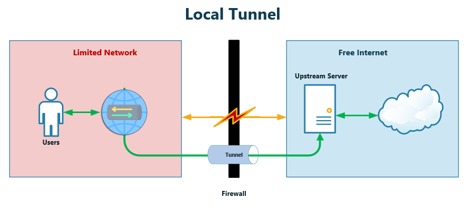
</p>

>اگر احتمال می دهید که با برقراری ارتباط امکان بلاک شدن آی پی سرور بالادستی وجود دارد، برای اتصال از نوع ریموت استفاده کنید

### تونل از راه دور (Remote)

اگر سرور رابط در اتصال به سرور بالادستی مشکل دارد و یا آی پی سرور بالادستی فیلتر و یا بلاک شده است باید از تونل از نوع معکوس و یا همان از راه دور   استفاده کرد، 
در این روش نرم افزار در سرور بالادستی قرار گرفته و اتصال را با سرور رابط برقرار کرده و پورت نهایی در سرور رابط در اختیار کاربر قرار می گیرد 

<p align="center">
    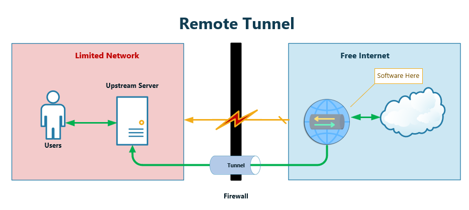
</p>


### تونل پویا (Dynamic)

در این روش یک اتصال امن بین دو سرور ار نوع SOCKS برقرار شده و کل ترافیک شبکه سرور بالادستی به سرور پل منتقل شده ولی در اختیار کاربر نهایی قرار نمی گیرد.

- این نوع اتصال زمانی کاربرد دارد که شما بر روی سرور رابط به اینترنت بدون محدودیت نیاز دارید

<p align="center">
    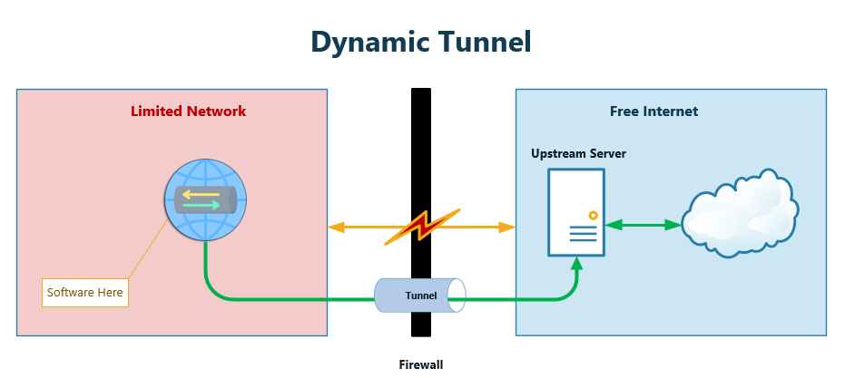
</p>

## راه اندازی
بسته به شرایط توضیح داده شده کل پروژه را روی یکی از سرور ها کلون کنید


```bash
git clone https://github.com/beigi-reza/ssh-tunnel-managment
```


### ایجاد کلید
این برنامه برای اتصال بین سرور ها و بالا بردن امنیت از `SSH_KEY` به جای کلمه عبور استفاده می کند.
ابتدا یک شاخه در مسیر اصلی نرم افزار به نام `key` ایجاد کنید

```bash
cd ssh-tunnel-managment
mkdir key
```
و سپس کلید را با فرمان زیر ایجاد کنبد

```bash
ssh-keygen -t rsa -b 4096 -f key/id_rsa -C "ssh-tunnel-managment"
```
اضافه کردن کلید عمومی به سرور مقصد 

```bash
ssh-copy-id -i key/id_rsa.pub <USER>@<IP>
```

## اجرا

از مسیر اصلی فایل `tunnel.py` را اجرا کنید 

```bash
./tunnel.py
```
<p align="center">
    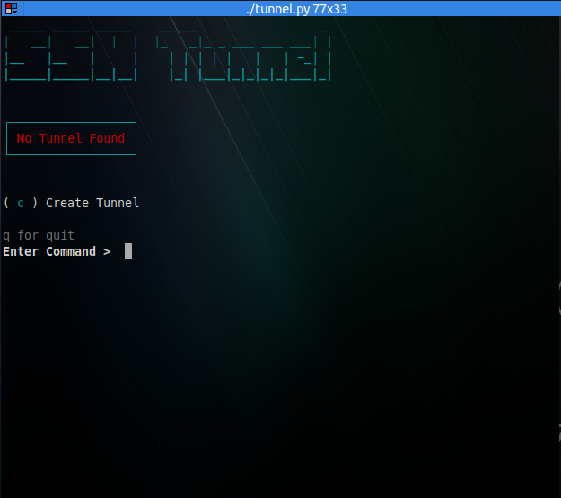
</p>

- با زدن حرف c یک کلید ابجاد کنید 
- در منوی بعدی نوع تونل را انتخاب کنید

<p align="center">
    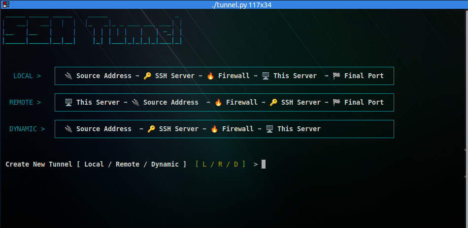
</p>

اطلاعات ssh  سرور مقصد را وارد کنید.

- SSH IP
- SSH User
- SSH port


<p align="center">
    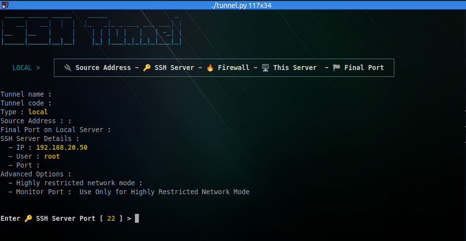
</p>


اطلاعات آدرس مبدا تونل را وارد کنید.

این آدرس می تواند یکی از موارد زیر باشد.

- یک پورت باز شده در سرور بالادستی  
- یک پورت محلی در سرور بالادستی که به صورت داخلی باز شده است  
- یک پورت بر روی یک سرور ثانوی که سور بالادستی به آن دسترسی دارد

<p align="center">
    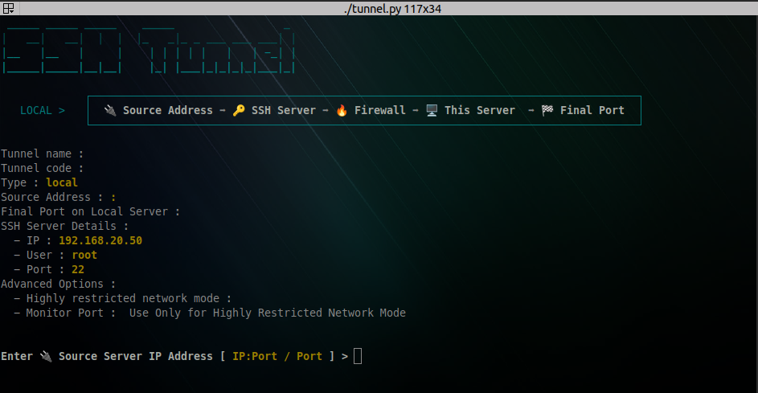
</p>


#### پورت مقصد

پورت مقصد و یا نهایی را وارد کنید این پورت در سرور بالادستی در اختیار کاربران قرار خواهد گرفت

<p align="center">
    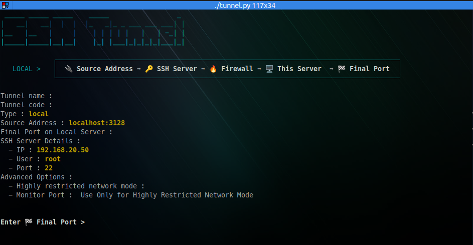
</p>


#### فعال سازی حالت محدودیت شدید شبکه
 در حالت معمولی این نرم افزار از تونل های بر قرار شده در برابر اختلالات شبکه محافظت می کند ولی اگر با اختلالات شدید شبکه روبرو هستید و یا به دلیل تنظیمات انجام شده در سطج ارائه دهنده خدمات و یا زیر ساخت اتصالات تونل پس از مدتی قطع می شوند بهتر است حالت `محدودیت شدید شبکه` را فعال کنید 

> توجه  داشته باشد که باین برنامه در حالت مجدودیت شدید شبکه علاوه بر پکیچ ssh از پکیج Autossh  نیز استفاده خواهد کرد و این بسته نرم افزاری باید بر روی سرور مبدا وجود دشته باشد 

برای فعال کردن این گزینه کلید y  را بزنید.

<p align="center">
    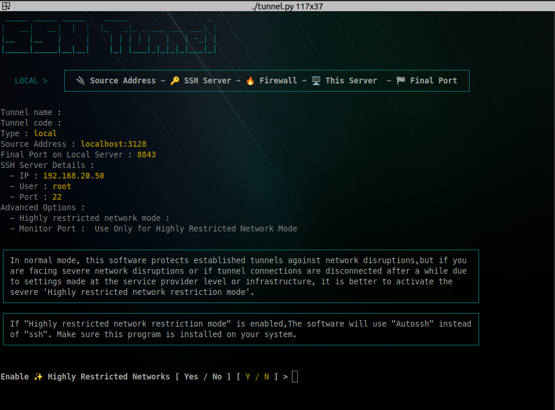
</p>

#### پایش مداوم تونل از طریق مونیتور کردن آن

این یک مکانیزم مهم برای نظارت بر وضعیت تونل ها می باشد
این مکانیزم یک جفت اتصال داخلی (loopback) بین خودش و سرور مفصد ایجاد می کند 

ترم افزار از این پورت اضافی برای ارسال و دریافت بسته های کوچک استفاده می کند تا از برقرار بودن و عملکرد صحیح تونل اطمینان یابد  و اگر اتصال به هر دلیلی در آن اختلال به وجود بیاید (قطغ شدن اینترنت، فریز شدن سرور مقصد و یا کشته شدن اتصال توسط زیر ساخت) نرم افزار متوجه می شود که اتصال مرده است و مجددا آن را بازسازی می کتد.

نکات مهم:

- این امکان فقط در حالتی در دسترس است که گزینه محدودیت شدید شبکه را فعال کرده باشید.
- این پورت به صورت زوج باز می شود به عنوان مثال اگر پورت 20000 را به عنوان پورت مونیتور اعلام کرده باشد این پورت  همراه با +1 آن یعنی 20001 در سرور فعلی به صورت داخلی و پورت 20000 در سرور مقصد به صورت خارجی باز خواهد شد
- مقدار 0 این گزینه را غبر فعال می کند

<p align="center">
    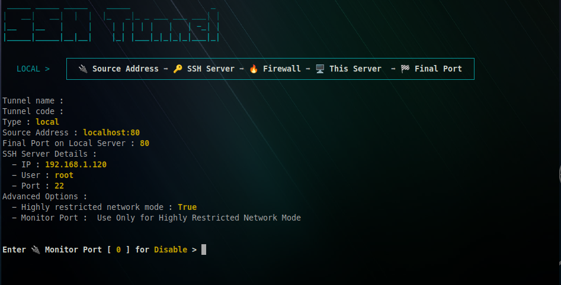
</p>


یک نام و کد برای تونل وارد کرده و در نهایت آن را ذخیره کنید

<p align="center">
    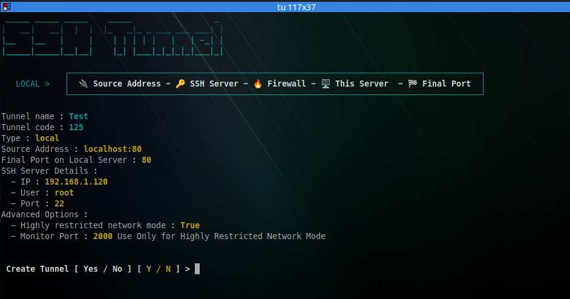
</p>


<p align="center">
    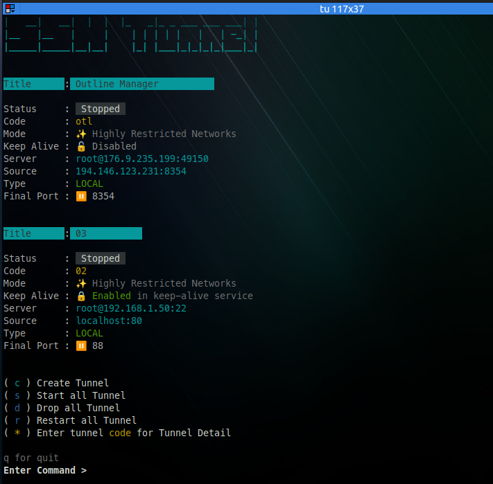
</p>

برای استارت همه توتل ها کلید `s` را بزنید 

<p align="center">
    
</p>

برای توقف همه تونل ها کلید `d` را بزنید 

### مدیریت تونل ها

برای مشاهده جزییات یک کلبد و تغییر وضعیت آن کد آن را در منوی اصلی وارد کنید

<p align="center">
    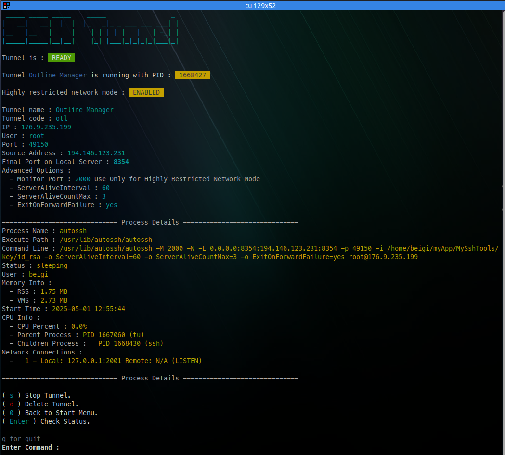
</p>


##  حالت محدودیت شدید شبکه

نرم افزار autossh را بر روی سرور نصب کنید


in Debian/Ubuntu

```bash
sudo apt update
sudo apt-get install autossh
```

in Fedora/Centos/RHEL

```bash
sudo yum install autossh
```

in Arch Linux
```bash
sudo pacman -S autossh
```

در تنظیمات تونل تغییرات زیر را اعمال کنید

در بخش `Highly_Restricted_Networks` گزینه `Enable` را `true` کنید 

```json
        {
            "Name": "Tunnel Name 2",
            "Code": "t2",
            "ssh_ip" : "192.168.2.2",
            "ssh_user" : "root",
            "ssh_port" : "22",            
            "FinalPort": "3124",
            "Source_Server": "localhost",
            "Source_port": "3124",
            "Type" : "remote",
            "Keep_Alive": true,
            "Highly_Restricted_Networks":{
                "Enable" : true,
                "ExitOnForwardFailure" :"yes",
                "ServerAliveInterval":60,
                "ServerAliveCountMax":3,
                "MonitorPort": 
            }                
```

### مانیتور کردن پورت 
اگر امکان دسترسی به پورت های دیگری در سرور مقصد دارید یک پورت دیگر را برای تونل تخصیص دهید و در بخش `MonitorPort` وارد کنید . 
دقت کنید این پورت در سرور مقصد باز خواهد شد و بایدبرای هر تونل  اختصاصی باشد 
مقدار `0` این گزینه را غیر فعال می کند

```json
{
    ..
    ..    
    "Keep_Alive": true,
    "Highly_Restricted_Networks":{
        "Enable" : true,
        "ExitOnForwardFailure" :"yes",
        "ServerAliveInterval":60,
        "ServerAliveCountMax":3,
        "MonitorPort": 2100    
}
```

## زنده نگهداشتن تونل در هر شرایط

در صورت راه اندازی سرویس `keep-alive` تونل های برقرار شده تحت هر شرایطی فعال نگه داشته خواهند شد، حتی با راه اندازی مجدد و یا بسته شدن تونل توسط کاربر تونل مجددا فعال خواهد شد.
تنها راه غیر متوقف کردن تونل ها توقف سرویس `keep-alive`خواهد بود.

برای اینکه یک تونل در حالت `keep-alive` نگهداشته شود، گزینه `keep-live` در تنظیمات آن باید در حالت `true` باشد


```json
        {
            ..
            ...
            "Source_port": "3124",
            "Type" : "remote",
            "Keep_Alive": true,
            ..
            ..
        }
```

### فعال کردن سرویس keep-alive

یک شاخه به نام logs در مسیر اصلی نرم افزار ایجاد کنید

```bash
mkdir logs
```

یک فایل به نام `keep-alive.service` در مسیر `/etc/systemd/system/` ایجاد کنید 


```bash
nano /etc/systemd/system/keep-alive.service
```

خطوط آن را به آن اضافه کنید و در صورت لزوم مسیر نرم افزار را اصلاح کنید

```
[Unit]
Description=Keep Alive Service
After=network.target

[Service]
User=root
WorkingDirectory=/root/ssh-tunnel-managment
ExecStart=/usr/bin/python3 /ssh-tunnel-managment/keep-alive.py
Restart=always
RestartSec=10

[Install]
WantedBy=multi-user.target
```

سرویس را فعال کنید 

```bash
sudo systemctl daemon-reload
sudo systemctl enable keep-alive.service
```

و برای راه اندازی

```bash
sudo systemctl start keep-alive.service
```

برای بررسی وضعیت تونل ها می توانید فایل `tunnel.py` را اجرا کنید و یا از فایل `KeepAlivelog.csv` ایجاد شده در شاخه لاگ مراجه کنید

```bash
tail -f logs/KeepAlivelog.csv
```

## اجرا به صورت پارمتر های خط فرمان (Command line Argument)

امکان راه اندای و یا توقف تونل ها از طریق حط فرمان هم وجود دارد 


راه اندازی همه تونل ها
```
./tunnel.py -s
```

توقف همه تونل ها
```
./tunnel.py -d
```

راه اندازی مجدد تونل ها
```
./tunnel.py -s
```

## مشکلات رایج

تونل فعال نمی شود وبا بلافاصله پس از فعال شدن غیر فعال می گردد

 - ایراد در تنظیمات 
 - پورت نهایی آزاد نمی باشد.
 - کلید ssh به درستی راه اندازی نشده است.

تونل فعال است و پورت مقصد هم باز شده است ولی هیچ اطلاعاتی دریافت نمی گردد
 
 - پورت مبدا اشتباه است 
 - اگر نوع تونل ریموت می باشد، گزینه GatewayPorts درتنظیمات سرور پل فعال نشده است .

### فعال کردن گزینه `GatewayPorts` در سرور رابط

اگر گزینه `GatewayPorts` در تنظیمات سرور رابط فعال نباشد پورت به صورت لوکال باز خواهد شد و فقط از روی سرور به آن دسترسی وجود خواهد داشت 

فایل `sshd_config` را از مسیر /etc/ssh باز کرده

```bash 
nano /etc/ssh/sshd_config
```
و مقدار `GatewayPorts` را در فایل پیدا کرده و مقدار آن را به `true` تغییر دهید 

```config
#AllowAgentForwarding yes
#AllowTcpForwarding yes
GatewayPorts yes
#X11Forwarding yes
#X11DisplayOffset 10
#X11UseLocalhost yes
#PermitTTY yes
PrintMotd no
#PrintLastLog yes
```

و سپس سرویسی ssh را مجددا راه اندازی کنید

```bash
systemctl restart sshd
```


